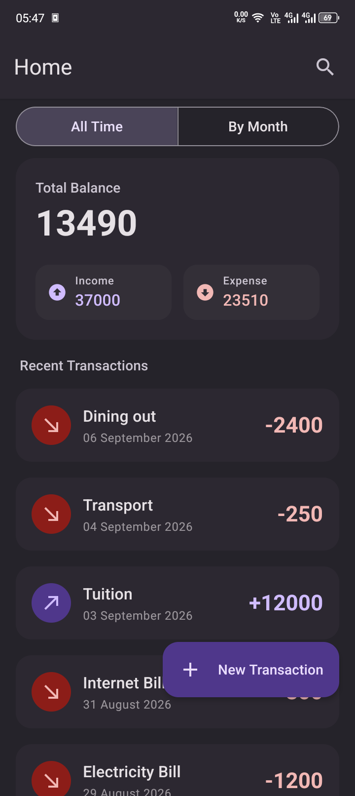
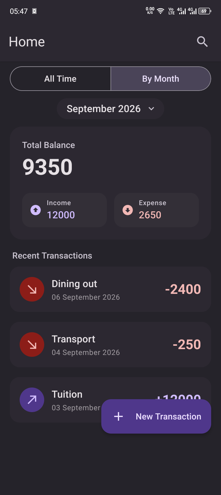
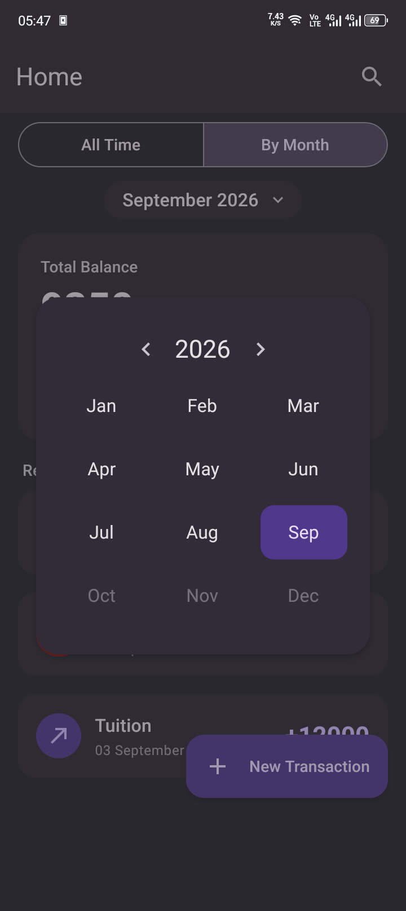
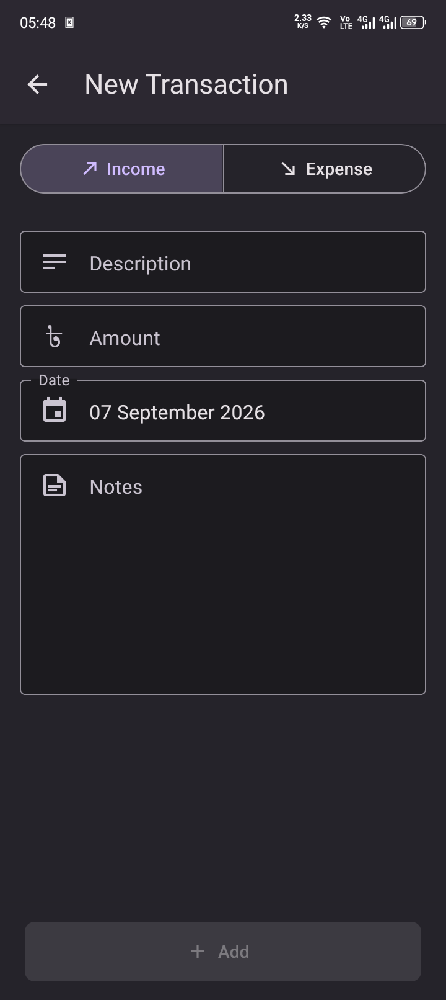
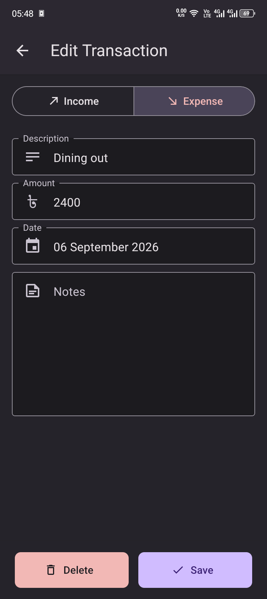

# Perfin

A simple finance manager app for Android.

## Overview

Perfin is a personal finance manager app for tracking income and expenses. Users can log transactions, review their spending all-time or broken down by month, and quickly add or edit entries, all powered by fully client side system that stores data on device.

## Download

Download the apk from [Releases page](https://github.com/mjobayed/perfin/releases).

## Features

- All-time transaction overview
- Monthly breakdown with a month picker
- Add new transactions
- Edit/Delete existing transactions

## Tech stack

- React Native (Expo)
- TypeScript
- React Native Paper (UI components)

## Screenshots

| All Time                                               | By Month                                               | Month Picker                                           |
| ------------------------------------------------------ | ------------------------------------------------------ | ------------------------------------------------------ |
|  |  |  |

| New Transaction                                        | Edit Transaction                                       |
| ------------------------------------------------------ | ------------------------------------------------------ |
|  |  |

## Getting Started

```bash
git clone https://github.com/mjobayed/perfin.git
cd perfin
npm install
npx expo start
```

## License

MIT
